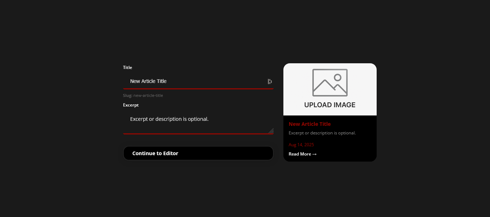
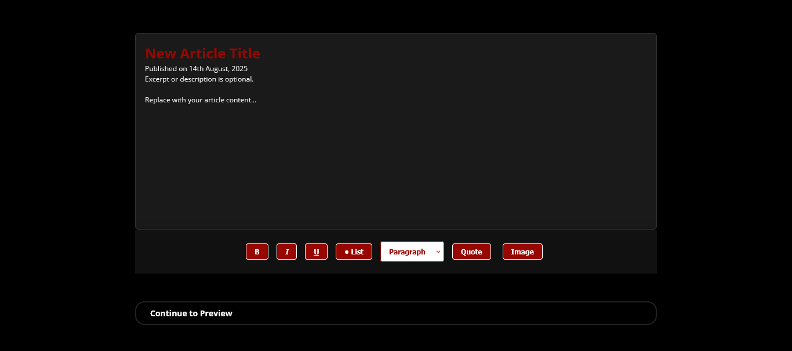
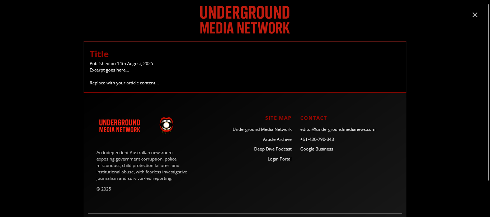
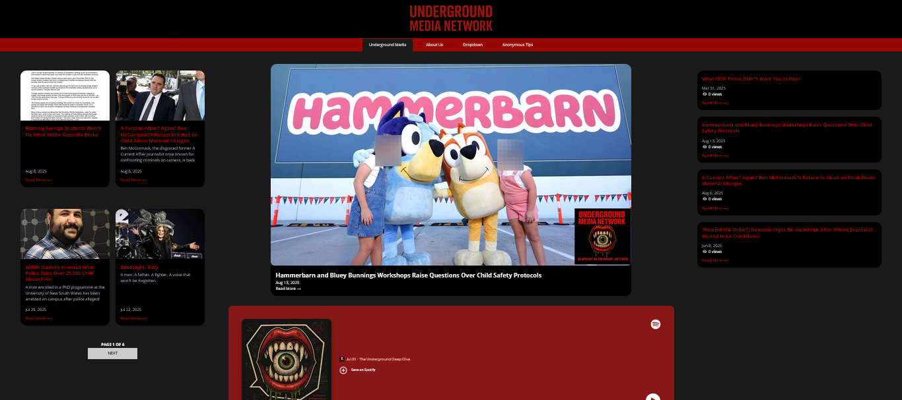

##### Documentation
# Underground Media Network
## Hosted on: KeiCMS

## Table of Contents
- [About](#about)
    - [Notes](#notes)
    - [Features](#features)
        - [API](#articles)
- [Screenshots](#screenshots)
- [Requirements](#requirements)
- [Security](#security)
- [Cross-Domain API](#cross-domain-api)

## About
This project is managed by Keirran Blackley. KeiCMS is a Content Management System for PHP and SQL databases.

[View Website](https://example.com/) - 
[Developer GitHub](https://github.com/KeiBlackley) -
[Donate](https://paypal.me/KeiBlackley)

### Notes
SMS 2FA codes will be added. 
Email on Official needs to be fixed. 
Add password constraints.
Extend security to sensitive data.

### Features

#### API
> In Development

Features an API through **Underground Media Network** for article posting. Publish, Edit and Delete articles through this CMS. See the references images for details.

 Setup Article (click to view) 

 

 Article Editor (click to view) 

 

 Preview Article (click to view) 

 (<a href="#documentation">back to top</a>) 

## Screenshots

 Alpha (click to view) 

<blockquote>This version has its own Articles Database. Pulls Spotify Data for Podcasts. Members Login.</blockquote>

## Requirements
- PHP (recommended: 7.4+)
- Web server (Apache, XAMPP, etc.)
- Database (MySQL, MariaDB)
- STMP or Bridge (Emailing)
- [Composer](https://getcomposer.org/) (Dependency Manager)
- optional: [reCAPTCHA](https://developers.google.com/recaptcha) (for Form Authentication)

## Security
- [Account Information](#account-information)
- [reCAPTCHA](#recaptcha)
- [Two-Factor Authentication](#two-factor-authentication)
- [API Authentication](#api-authentication)
- [Access Control](#access-control)

### Account Information
Users are required to signup with an email address, which will be verified after first signin (due to default numeric code authentication). This will not be used for signin.

 

 Disclaimer: 

Email addresses are used for:
- Signup Complete Confirmation
- Two-Factor Authentication (Numeric Code)
- Reset Password
- Support Messages

 

Usernames are required to login, as well as passwords. Passwords are a minimum of 8 characters and are hashed (which means algorithmic alphanumeric strings are generated and will only return valid if they both match).
> TODO: define more constraints to password

### reCAPTCHA
Optional and toggleable via ADMPanel for site.
This generally uses Google reCAPTCHA for registeration forms, contact, etc..

### Two-Factor Authentication
Default mode is set to `numeric code authentication`. You will receive an email with the code to be entered after your username/password succeeds.

Also supports Authenticator App verification.

> All 2FA modes can be disabled, allowing only username and password authentication.

### API Authentication
API Authentication via KeiCMS DB.

### Access Control
Content limiting with role credentials and signin status.

 (<a href="#documentation">back to top</a>) 

## Cross-Domain API
As mentioned, it uses KeiCMS DB for API Authenticate securely.

### Security Benefits
- **Tamper-Proof** 

 (<a href="#documentation">back to top</a>) 
